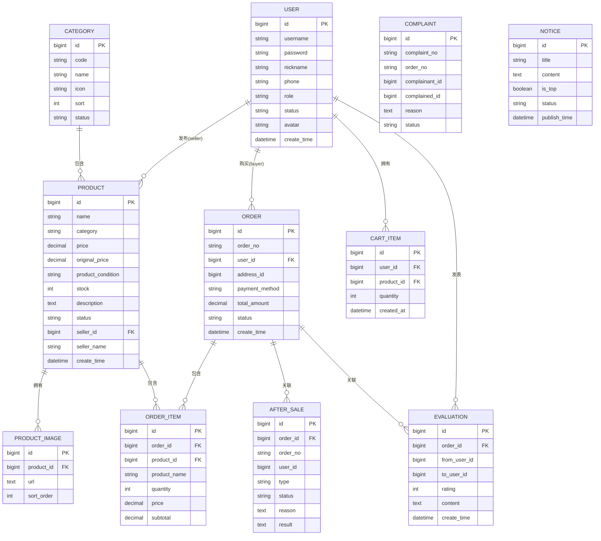

# 校园二手交易平台 ER 图

## 实体关系概览

```
┌─────────────────┐       ┌─────────────────┐       ┌─────────────────┐
│     User        │       │   Category      │       │    Notice       │
│    (用户)       │       │   (分类)        │       │   (公告)        │
└────────┬────────┘       └────────┬────────┘       └─────────────────┘
         │                         │
         │ 1:N                     │ 1:N
         ▼                         ▼
┌─────────────────┐       ┌─────────────────┐
│    Product      │◄──────┤  ProductImage   │
│   (商品)        │  1:N  │  (商品图片)     │
└────────┬────────┘       └─────────────────┘
         │
         │ 1:N ( seller_id )
         │
         │ N:1 ( buyer_id )
         ▼
┌─────────────────┐       ┌─────────────────┐
│     Order       │◄──────┤   OrderItem     │
│   (订单)        │  1:N  │  (订单项)       │
└────────┬────────┘       └─────────────────┘
         │
         │ 1:N
         ▼
┌─────────────────┐       ┌─────────────────┐
│   AfterSale     │       │   Evaluation    │
│   (售后)        │       │   (评价)        │
└─────────────────┘       └─────────────────┘
         │
         │ 1:N
         ▼
┌─────────────────┐
│   Complaint     │
│   (投诉)        │
└─────────────────┘

┌─────────────────┐
│   CartItem      │
│   (购物车)      │
└─────────────────┘
```

---

## 实体详细定义

### 1. User (用户表) - sys_user

| 字段名 | 类型 | 约束 | 说明 |
|--------|------|------|------|
| id | BIGINT | PK, Auto | 用户ID |
| username | VARCHAR(64) | Unique, Not Null | 用户名 |
| password | VARCHAR(128) | Not Null | 密码 |
| nickname | VARCHAR(64) | | 昵称 |
| phone | VARCHAR(20) | | 手机号 |
| role | VARCHAR(20) | Default 'buyer' | 角色(buyer/seller/admin) |
| status | VARCHAR(20) | Default '正常' | 状态 |
| avatar | VARCHAR(255) | | 头像URL |
| create_time | DATETIME | | 创建时间 |
| last_login_time | DATETIME | | 最后登录时间 |

**关系：**
- 1:N → Product (作为卖家)
- 1:N → Order (作为买家)
- 1:N → CartItem
- 1:N → Evaluation

---

### 2. Category (分类表) - categories

| 字段名 | 类型 | 约束 | 说明 |
|--------|------|------|------|
| id | BIGINT | PK, Auto | 分类ID |
| code | VARCHAR(20) | Unique, Not Null | 分类编号 |
| name | VARCHAR(50) | Unique, Not Null | 分类名称 |
| icon | VARCHAR(20) | | 图标 |
| sort | INT | Default 1 | 排序 |
| status | VARCHAR(20) | Default '启用' | 状态 |
| created_at | DATETIME | | 创建时间 |

**关系：**
- 1:N → Product

---

### 3. Product (商品表) - product

| 字段名 | 类型 | 约束 | 说明 |
|--------|------|------|------|
| id | BIGINT | PK, Auto | 商品ID |
| name | VARCHAR(255) | Not Null | 商品名称 |
| category | VARCHAR(100) | | 分类 |
| price | DECIMAL(10,2) | Not Null | 售价 |
| original_price | DECIMAL(10,2) | | 原价 |
| product_condition | VARCHAR(50) | | 成色 |
| stock | INT | Default 0 | 库存 |
| description | TEXT | | 描述 |
| status | VARCHAR(20) | Default '上架' | 状态 |
| seller_id | BIGINT | Not Null | 卖家ID |
| seller_name | VARCHAR(100) | | 卖家名称 |
| create_time | DATETIME | | 创建时间 |
| update_time | DATETIME | | 更新时间 |

**关系：**
- N:1 → User (seller_id)
- N:1 → Category
- 1:N → ProductImage
- 1:N → OrderItem
- 1:N → Evaluation

---

### 4. ProductImage (商品图片表) - product_image

| 字段名 | 类型 | 约束 | 说明 |
|--------|------|------|------|
| id | BIGINT | PK, Auto | 图片ID |
| product_id | BIGINT | FK, Not Null | 商品ID |
| url | TEXT | Not Null | 图片URL |
| sort_order | INT | Default 0 | 排序 |
| created_at | DATETIME | | 创建时间 |

**关系：**
- N:1 → Product

---

### 5. Order (订单表) - orders

| 字段名 | 类型 | 约束 | 说明 |
|--------|------|------|------|
| id | BIGINT | PK, Auto | 订单ID |
| order_no | VARCHAR(32) | Unique, Not Null | 订单号 |
| user_id | BIGINT | Not Null | 买家ID |
| address_id | BIGINT | Not Null | 地址ID |
| payment_method | VARCHAR(20) | Not Null | 支付方式 |
| total_amount | DECIMAL(10,2) | Not Null | 总金额 |
| status | VARCHAR(20) | Not Null | 订单状态 |
| create_time | DATETIME | | 创建时间 |

**关系：**
- N:1 → User (buyer)
- 1:N → OrderItem
- 1:N → AfterSale
- 1:N → Evaluation

---

### 6. OrderItem (订单项表) - order_items

| 字段名 | 类型 | 约束 | 说明 |
|--------|------|------|------|
| id | BIGINT | PK, Auto | 订单项ID |
| order_id | BIGINT | FK, Not Null | 订单ID |
| product_id | BIGINT | FK | 商品ID |
| product_name | VARCHAR(100) | | 商品名称 |
| quantity | INT | Not Null, Default 1 | 数量 |
| price | DECIMAL(10,2) | Not Null | 单价 |
| subtotal | DECIMAL(10,2) | Not Null | 小计 |

**关系：**
- N:1 → Order
- N:1 → Product

---

### 7. CartItem (购物车表) - cart_items

| 字段名 | 类型 | 约束 | 说明 |
|--------|------|------|------|
| id | BIGINT | PK, Auto | 购物车ID |
| user_id | BIGINT | Not Null | 用户ID |
| product_id | BIGINT | Not Null | 商品ID |
| quantity | INT | Not Null | 数量 |
| created_at | DATETIME | | 创建时间 |
| updated_at | DATETIME | | 更新时间 |

**关系：**
- N:1 → User
- N:1 → Product

---

### 8. Evaluation (评价表) - evaluation

| 字段名 | 类型 | 约束 | 说明 |
|--------|------|------|------|
| id | BIGINT | PK, Auto | 评价ID |
| order_id | BIGINT | FK, Not Null | 订单ID |
| from_user_id | BIGINT | Not Null | 评价人ID |
| to_user_id | BIGINT | | 被评价人ID |
| rating | INT | Not Null | 评分(1-5) |
| content | TEXT | | 评价内容 |
| create_time | DATETIME | | 创建时间 |

**关系：**
- N:1 → Order
- N:1 → User (from_user)
- N:1 → User (to_user)

---

### 9. AfterSale (售后表) - after_sale

| 字段名 | 类型 | 约束 | 说明 |
|--------|------|------|------|
| id | BIGINT | PK, Auto | 售后ID |
| order_id | BIGINT | FK | 订单ID |
| order_no | VARCHAR(30) | | 订单号 |
| user_id | BIGINT | | 申请用户ID |
| type | VARCHAR(20) | | 售后类型 |
| status | VARCHAR(20) | | 处理状态 |
| reason | TEXT | | 申请原因 |
| result | TEXT | | 处理结果 |
| admin_id | BIGINT | | 处理管理员ID |
| admin_remark | VARCHAR(500) | | 管理员备注 |
| handle_time | DATETIME | | 处理时间 |
| created_at | DATETIME | | 创建时间 |
| updated_at | DATETIME | | 更新时间 |

**关系：**
- N:1 → Order
- N:1 → User (applicant)
- N:1 → User (admin)

---

### 10. Complaint (投诉表) - complaint

| 字段名 | 类型 | 约束 | 说明 |
|--------|------|------|------|
| id | BIGINT | PK, Auto | 投诉ID |
| complaint_no | VARCHAR(32) | Unique | 投诉编号 |
| refund_no | VARCHAR(64) | | 退款单号 |
| order_no | VARCHAR(64) | | 订单号 |
| complainant_id | BIGINT | | 投诉人ID |
| complainant_name | VARCHAR(64) | | 投诉人姓名 |
| complained_id | BIGINT | | 被投诉人ID |
| complained_name | VARCHAR(64) | | 被投诉人姓名 |
| reason | TEXT | | 投诉原因 |
| complaint_type | VARCHAR(20) | | 投诉类型 |
| status | VARCHAR(20) | Default '待处理' | 状态 |
| create_time | DATETIME | | 创建时间 |

**关系：**
- N:1 → User (complainant)
- N:1 → User (complained)

---

### 11. Notice (公告表) - notice

| 字段名 | 类型 | 约束 | 说明 |
|--------|------|------|------|
| id | BIGINT | PK, Auto | 公告ID |
| title | VARCHAR(200) | Not Null | 标题 |
| content | TEXT | | 内容 |
| is_top | BOOLEAN | Default false | 是否置顶 |
| status | VARCHAR(20) | Default '草稿' | 状态 |
| publish_time | DATETIME | | 发布时间 |
| create_time | DATETIME | | 创建时间 |
| update_time | DATETIME | | 更新时间 |

---

## 关系汇总表

| 关系 | 类型 | 说明 |
|------|------|------|
| User → Product | 1:N | 一个用户可以发布多个商品 |
| User → Order | 1:N | 一个用户可以创建多个订单 |
| User → CartItem | 1:N | 一个用户可以有多个购物车项 |
| User → Evaluation | 1:N | 一个用户可以发表多个评价 |
| Category → Product | 1:N | 一个分类下可以有多个商品 |
| Product → ProductImage | 1:N | 一个商品可以有多个图片 |
| Product → OrderItem | 1:N | 一个商品可以出现在多个订单项中 |
| Order → OrderItem | 1:N | 一个订单可以有多个订单项 |
| Order → AfterSale | 1:N | 一个订单可以有多个售后记录 |
| Order → Evaluation | 1:N | 一个订单可以有多个评价 |

---

## 数据库表关系图 (Mermaid)



---

## 关键业务说明

### 1. 用户角色
- **buyer (买家)**: 可以浏览商品、下单购买、发表评价
- **seller (卖家)**: 可以发布商品、管理自己的商品
- **admin (管理员)**: 可以管理所有商品、订单、用户，处理售后和投诉

### 2. 订单流程
```
创建订单 → 待付款 → 已付款 → 已发货 → 已完成 → 评价
              ↓
            已取消
```

### 3. 售后流程
```
申请售后 → 待处理 → 处理中 → 已完成/已拒绝
              ↓
            仲裁中 → 已解决
```

### 4. 购物车机制
- 用户可以将商品加入购物车
- 购物车数据持久化存储
- 结算时从购物车生成订单
